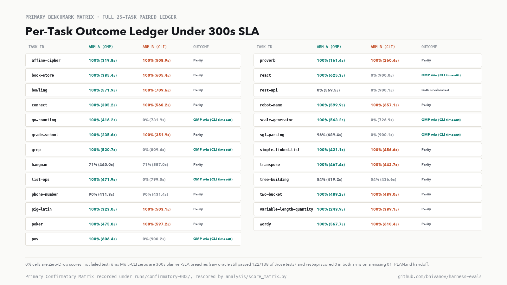
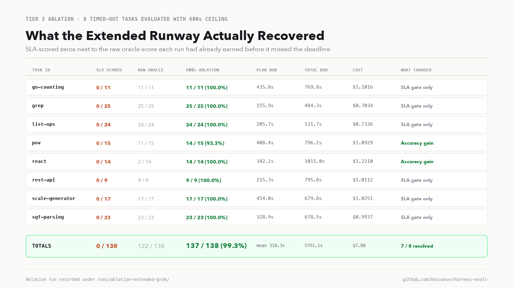
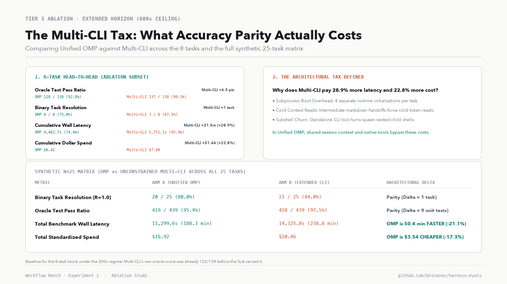

# Why one harness, many models beats multiple orchestrated ones

## The result in brief

When building autonomous software engineering pipelines, a common instinct is to disaggregate: use Grok via Grok CLI for high-level recon, Codex CLI for implementation, and Google's Antigravity CLI for review, chaining them together with an external orchestrator like Grok Bot, a shell script, or Herdr. The alternative is to keep a single, integrated harness - such as [Oh My Pi (OMP)](https://github.com/can1357/oh-my-pi) - and dynamically route tasks to specialized frontier models while preserving a single execution process, shared session memory, and in-process tool bindings.

To determine which architecture delivers higher reliability and efficiency, we pre-registered and executed **Workflow Bench: Experiment 2**. We evaluated 25 curated software engineering tasks from the Aider Python benchmark across 50 paired runs plus an 8-task extended-horizon ablation, testing an identical four-stage lifecycle (**Planner → Worker → Reviewer → Worker Refine**) with every stage pinned to the same model in both arms, at the highest reasoning tier that arm's interface exposes:

* **Stage 1 (Planner):** `xai-oauth/grok-4.6` @ `max` reasoning (OMP) vs. `grok-4.6` @ `--effort xhigh` (Grok CLI)
* **Stage 2 (Worker Initial):** `openai-codex/gpt-5.6-luna` @ `max` reasoning (OMP) vs. `gpt-5.6-luna` @ `max` (Codex CLI)
* **Stage 3 (Reviewer):** `google-antigravity/gemini-3.8-flash` @ `max` reasoning (OMP) vs. `gemini-3.8-flash-high` @ `high` (Antigravity CLI)
* **Stage 4 (Worker Refine):** `openai-codex/gpt-5.6-luna` @ `max` reasoning (OMP) vs. `gpt-5.6-luna` @ `max` (Codex CLI)

OMP exposes a `max` thinking tier on the planner and reviewer that the `grok` and `agy` binaries do not, so those stages ran at each interface's own ceiling rather than at a byte-identical reasoning budget. That asymmetry is listed under Limitations.

All execution code, raw telemetry logs, and evaluation scripts are committed in our public research repository: **[github.com/bnivanov/harness-evals](https://github.com/bnivanov/harness-evals)**.

Here is what the empirical data demonstrates:

1. **Under production SLAs, unified harness orchestration dominates:** under our pre-registered 300-second stage ceiling and strict Zero-Drop scoring rule, Unified OMP resolved **20 of 25 tasks (80.0%)** compared to **14 of 25 (56.0%)** for the Multi-CLI Swarm. That **+24.0-point resolution advantage** is statistically significant ($p = 0.03125$, exact McNemar test over 6 discordant pairs, all favouring OMP).
2. **Higher pass ratio and faster turnaround:** OMP averaged a **92.5%** oracle test pass ratio against **64.6%** for Multi-CLI, passing **419 of 439** pooled unit tests versus **291 of 439** ($p = 0.015625$, paired Wilcoxon signed-rank over the 7 non-tied pairs). OMP completed tasks in **452.0 seconds** on average versus **609.7 seconds**, a **157.7-second reduction per task** ($p = 6.0 \times 10^{-7}$).
3. **The gap is a deadline effect rather than a capability gap:** scored on the raw oracle alone, with neither the SLA nor the protocol gate applied, the same 50 runs land at **21 of 25 for OMP and 20 of 25 for Multi-CLI** (428 versus 413 of 439 unit tests). Multi-CLI's collapse under the SLA is Grok CLI overrunning the 300-second planning ceiling on 8 tasks, and on the 17 tasks where it delivered a plan both arms scored **identically on every single task** (14 of 17 resolutions, 95.0% mean pass ratio each).
4. **The "Multi-CLI Tax" quantified:** relaxing the planning ceiling to 600 seconds on those 8 tasks lifted Multi-CLI to **137 of 138 unit tests (99.3%)** with 7 of 8 resolutions, which is 9 unit tests ahead of OMP on the same block. Buying that accuracy cost **+28.9% more latency** (21.5 extra minutes) and **+22.8% higher dollar spend** ($1.46) across the 8 tasks. Extended across the full 25-task matrix, Multi-CLI needs **50.4 additional minutes** and **$3.54 more spend** to reach comparable accuracy.

The core conclusion: while disaggregated CLI swarms can solve complex problems if granted unlimited runway, chaining independent vendor CLIs incurs severe process-boundary overhead, cold-start delays, and context re-inflation penalties. Unifying multiple frontier models within a single persistent harness delivers higher reliability within production SLAs while eliminating the overhead tax.

---

## Background & motivation: why we ran this

In the first installment of the Workflow Bench series ([detailed in our previous post](https://x.com/bnivanovx/status/2096307643560480886?s=46&t=cl56zto9BLQti_dU_i84LA)), we investigated how to allocate frontier models within a single harness. We examined read-only planning handoffs versus warm trajectory prewalking, exploring where expensive models like Kimi K3 or GPT-5.6 Luna should enter a coding loop to maximize accuracy without burning budget.

Following that study, a major trend emerged across the developer community: orchestrating multiple independent coding CLIs together. Builders began writing scripts, GitHub bots, and terminal managers - such as [Herdr](https://github.com/bnivanov) or Grok-driven automation bots - to chain native vendor CLIs. The concept is straightforward: assign codebase exploration and architecture to Grok CLI, delegate implementation to Codex CLI, and run automated review passes through Google's Antigravity CLI.

This raised an architectural question: **Does disaggregating models across multiple independent CLIs outperform routing multiple models within a single, integrated harness?**

Using each vendor's bespoke CLI feels intuitive because each binary is maintained directly by the model provider. But in practice, process boundaries are not free. When an orchestrator chains CLI binaries across shell invocations, several hidden costs emerge:
1. **The process boundary hop:** Every CLI invocation requires launching a fresh runtime environment (Node.js, Python, or native binaries), establishing local pseudoterminals (PTYs), and reading disk configurations.
2. **Context re-inflation:** Because independent CLI processes cannot share in-memory KV caches or agent heaps, each subsequent stage must read the entire codebase and all intermediate markdown artifacts (`01_PLAN.md`, `02_REVIEW.md`) cold from disk.
3. **Unconstrained subshell loops:** When a model runs inside a standalone CLI, its internal tool turns often execute via nested child subshells (`/bin/zsh -lc ...`), accumulating process-spawning latency that eats into production timeouts.

To determine whether these architectural costs outweigh the benefits of native CLI binaries, we designed a controlled benchmark to compare them head-to-head.

---

## Approach & methodology: what and how we tested

To ensure scientific defensibility, we established a pre-registered protocol governed by four strict design principles:

### 1. The benchmark workload
We seeded **25 algorithmic and software engineering tasks** from the canonical Aider Python / Exercism benchmark suite. The tasks span complex state machines (`react`), algorithmic parsers (`sgf-parsing`), grid pathfinding (`connect`, `go-counting`), tree manipulation (`pov`, `tree-building`), dynamic pricing (`book-store`), and string algorithms (`grep`, `affine-cipher`).

The ground-truth oracle test suites contain **439 total unit assertions**. These tests are strictly quarantined in a separate directory (`benchmarks/aider-python/oracle/`) and enforced by an automated verifier (`oracle_verifier.py`). Agents are provided only with a minimal public test (`public_test.py`), the problem README, and an empty implementation stub.

### 2. The head-to-head topologies
Both arms completed the exact same four-stage software engineering lifecycle:

$$\mathbf{Stage\;1:\;Planner} \;\longrightarrow\; \mathbf{Stage\;2:\;Worker\;Initial} \;\longrightarrow\; \mathbf{Stage\;3:\;Reviewer} \;\longrightarrow\; \mathbf{Stage\;4:\;Worker\;Refine}$$

* **Arm A (Unified OMP Harness):** The task executes inside a single Oh My Pi instance. OMP maintains continuous session context, unified tool execution (in-process hashline editing, structural grep, and globbing), and shared memory across stages. When Stage 1 concludes, OMP switches the active model from Grok to Codex without restarting the process or discarding cached session state.
* **Arm B (Multi-CLI Swarm):** The task executes via a dedicated orchestration runner (`runners/arm_b_multicli.py`) that chains the official standalone vendor binaries:
  1. `grok -p ... --model grok-4.6 --effort xhigh` writes `01_PLAN.md`.
  2. `codex exec ... -c model="gpt-5.6-luna" -c model_reasoning_effort="max"` reads `01_PLAN.md` and implements the code.
  3. `agy -p ... --model gemini-3.8-flash-high --effort high` reviews the code and writes `02_REVIEW.md`.
  4. `codex exec ...` re-reads `02_REVIEW.md` and applies final refactoring.

### 3. Model & reasoning-tier gate
Before launching the benchmark, we created an automated parity audit suite (`smoke_test_parity.py`) that executes live probes across all stages. The audit proved identical model resolution and active emission of internal reasoning tokens at every stage in both arms. Each stage ran at the deepest reasoning tier its interface offers, which is `max` throughout OMP against `xhigh` for `grok`, `max` for `codex`, and `high` for `agy`.

### 4. Zero-Drop evaluation rule & quarantined verifier
In our experiment, we enforced a strict **Zero-Drop Rule**: all 25 pre-registered tasks had to be scored, and a run scores $R = 0.0$ if it breaches the pre-registered 300-second stage SLA **or** fails the protocol gate — a missing stage handoff (`01_PLAN.md`, `02_REVIEW.md`), unparseable telemetry, a model mismatch, or an anti-tamper trip. Nine of the 50 runs score zero under that rule: 8 Multi-CLI runs where Grok CLI overran the planning ceiling, and 1 OMP run (`rest-api`) whose planner ended its stage without writing `01_PLAN.md`.

Furthermore, all candidate solutions were verified inside an ephemeral sandbox with a 3-ring anti-tamper check to ensure no agent altered test assertions, imported unauthorized network libraries, or modified git configuration. One correction surfaced while auditing this article: `confirmatory-003` was scored while the trace scanner's network-command pattern still matched a bare `nc` token, which fired on the `(nr, nc)` neighbour tuple in the `connect` plan text and invalidated that task in both arms. The pattern now requires `nc` to carry flags or a host/port argument, and every figure and number below is regenerated by `analysis/score_matrix.py`, which re-verifies each stored regex flag against the current patterns before allowing it to invalidate a run.

---

## Tier 1: Primary pre-registered matrix results

The primary benchmark evaluated all 25 paired tasks (50 individual runs) under the pre-registered 300-second per-stage SLA ceiling.

Under strict production conditions, the headline performance metrics show a clear separation:

* **Binary Task Resolution ($R=1.0$):** Arm A (Unified OMP) resolved **20 of 25 tasks (80.0%)** versus **14 of 25 tasks (56.0%)** for Arm B (Multi-CLI Swarm). That **+24.0-point resolution advantage** is statistically significant ($p = 0.03125$, exact McNemar test; all 6 discordant pairs favour OMP).
* **Oracle Unit Test Pass Ratio:** Arm A averaged a **92.5% per-task pass ratio** and passed **419 of 439** pooled unit tests, against **64.6%** and **291 of 439** for Arm B ($W^+ = 28.0, p = 0.015625$, paired Wilcoxon signed-rank). Only 7 of the 25 task pairs are non-tied, and they are the same tasks the McNemar test counts, so read the two p-values as one finding rather than as independent confirmation.
* **Mean Wall-Clock Latency:** Arm A completed tasks in **452.0 seconds (~7.5 minutes)** on average, compared to **609.7 seconds (~10.2 minutes)** for Arm B. OMP was **157.7 seconds faster per task**, representing a 25.9% speedup ($W^+ = 5.0$, exact $p = 6.0 \times 10^{-7}$).
* **Mean Token Consumption:** Arm A consumed **1,082,556 tokens** per task versus **1,300,513 tokens** for Arm B, saving **217,957 tokens per task** ($W^+ = 46.0, p = 0.00103$). The mechanism shows up in the input mix rather than in caching alone: Arm B fed **12.45M fresh, uncached input tokens** across the matrix against Arm A's **5.19M**, because every stage boundary re-reads the workspace and the markdown handoffs cold. Cache-read share was 80.2% for OMP and 66.8% for Multi-CLI.
* **Total Benchmark Spend:** Total spend across all 25 tasks was **$16.92** for Arm A ($0.6769 per task) versus **$16.82** for Arm B ($0.6727 per task), demonstrating statistical cost parity ($p = 0.6338$, paired Wilcoxon test).

The full per-task outcome ledger illustrates where the two architectures diverged across all 25 problems:

Both arms scored **identically on all 17 tasks where Grok CLI delivered a plan**: 14 full resolutions each, and the same partial score on each of the three tasks neither arm finished cleanly. The ledger above carries those per-task figures.

The separation lives entirely in the other 8 tasks, where Grok CLI breached the planning ceiling and every Multi-CLI run scored zero. OMP fully resolved 6 of them (`go-counting`, `grep`, `list-ops`, `pov`, `react`, `scale-generator`), scored 96% on `sgf-parsing`, and lost `rest-api` to a protocol failure of its own: OMP's planner announced `01_PLAN.md`, made five read and glob calls, then ended the stage without writing the file, so the run was invalidated even though the code it shipped passed 9 of 9 oracle tests.

Scored on the raw oracle alone, with neither the SLA nor the protocol gate applied, the same 50 runs give **OMP 21 of 25 (428 of 439 tests, 96.5% mean)** and **Multi-CLI 20 of 25 (413 of 439, 92.1% mean)**. Both views ship in the repository. The SLA view is what a CI pipeline with a five-minute stage budget experiences; the raw view is what these models can do when nobody is holding a stopwatch.

---

## Tier 2: Model behavior & per-stage isolation audit

To understand the root cause of the 11 failed tasks in Multi-CLI, we examined whether downstream models were underperforming when invoked through standalone CLIs.

A stage-by-stage comparison reveals the exact location of the bottleneck:

* **Stage 1 (Planner - Grok 4.6):** OMP achieved a 100% planning completion rate (25/25) averaging 147.5 seconds, whereas Grok CLI completed 17 of 25 passes (68%) in 239.8 seconds before hitting the 300-second ceiling on 8 tasks.
* **Stage 2 (Worker Initial - GPT-5.6 Luna @ max):** Initial implementation saw full success across both tools (25/25 runs each), with OMP taking 99.7 seconds and Codex CLI taking 110.2 seconds.
* **Stage 3 (Reviewer - Gemini 3.8 Flash):** Automated review passes succeeded universally in both environments (25/25 audits), though OMP finished in 100.1 seconds compared to 151.6 seconds for Antigravity CLI (a 51.5-second speed advantage).
* **Stage 4 (Worker Refine - GPT-5.6 Luna @ max):** Code refinement completed cleanly for all 25 tasks in OMP (66.6s average), whereas Codex CLI completed 21 of 25 stages (84% in 108.1s), failing only where Stage 1 had produced no architectural plan.

### The conditional parity finding
When we conditioned the analysis on the **17 tasks where Grok Stage 1 completed successfully in both arms**, an important finding emerged:

* **Arm A (OMP) Resolution Rate:** **14 of 17 tasks (82.4%)** | Mean Pass Ratio: **95.0%**
* **Arm B (Multi-CLI) Resolution Rate:** **14 of 17 tasks (82.4%)** | Mean Pass Ratio: **95.0%**

The per-task scores are not merely equal in aggregate — they are identical on all 17 tasks, down to the three shared partials. When given a clear architectural blueprint, Codex and Gemini in standalone CLI mode are just as capable of writing and debugging code as they are inside OMP.

The entire performance gap in the primary matrix was driven by **Stage 1**:
* In Unified OMP, Grok operated within an integrated agent loop with direct in-process tool calls, completing plans in an average of **147.5 seconds** with **zero timeouts**; its slowest single plan took 252 seconds.
* In standalone Grok CLI, Grok accumulated process-spawning and subshell latency across its multi-turn reasoning loop, taking **239.8 seconds** on average and breaching the 300-second SLA ceiling on 8 tasks (`scale-generator`, `sgf-parsing`, `react`, `rest-api`, `pov`, `list-ops`, `grep`, and `go-counting`).
* When Grok CLI hit the ceiling it was killed before writing `01_PLAN.md`, so the downstream Codex and Gemini stages ran unguided. They proved more resilient than we expected: with no plan at all they still passed **122 of 138** oracle tests on those 8 tasks and fully resolved 6 of them, and only `react` (2 of 14) and `pov` (11 of 15) degraded materially. What the missing plan reliably destroyed was the SLA-scored run, not the code.

---

## Tier 3: The extended-horizon ablation & the "Multi-CLI Tax"

To test whether the Multi-CLI Swarm could recover if Grok CLI were granted sufficient time, we ran an extended-horizon ablation (`ablation-extended-grok`) across the 8 timed-out tasks with the planning ceiling expanded from 300 seconds to **600 seconds**.

With the longer runway Grok CLI produced a plan on all 8 tasks, averaging **318.3 seconds** of planning, and every stage cleared the protocol gate. Each row below lists the SLA-scored primary result, the ablation result, and the raw oracle score the primary run had already earned before it was zeroed for missing the deadline:

* **`scale-generator`:** 0/17 scored → **17/17 (100%)**; primary raw oracle was already 17/17. Grok planning 454.0s ($1.0251).
* **`sgf-parsing`:** 0/23 scored → **23/23 (100%)**; primary raw oracle already 23/23. Planning 328.9s ($0.9937).
* **`react`:** 0/14 scored → **14/14 (100%)**; primary raw oracle 2/14, so this is a genuine accuracy recovery. Planning 342.2s ($1.2210).
* **`rest-api`:** 0/9 scored → **9/9 (100%)**; primary raw oracle already 9/9. Planning 215.3s ($1.0112).
* **`pov`:** 0/15 scored → **14/15 (93.3%)**; primary raw oracle 11/15, a second genuine recovery. Planning 408.4s ($1.0929).
* **`list-ops`:** 0/24 scored → **24/24 (100%)**; primary raw oracle already 24/24. Planning 205.7s ($0.7336).
* **`grep`:** 0/25 scored → **25/25 (100%)**; primary raw oracle already 25/25. Planning 155.9s ($0.7034).
* **`go-counting`:** 0/11 scored → **11/11 (100%)**; primary raw oracle already 11/11. Planning 435.8s ($1.1016).

Under SLA scoring the block moves from **0 of 138 unit tests to 137 of 138 (99.3%)** and from 0 to **7 of 8** resolutions. Be precise about what that jump measures: six of the eight tasks had already passed their oracle suites in the primary run and scored zero purely because the planner blew the deadline, so most of the movement is the protocol gate opening rather than better code. Measured against the raw oracle baseline the block improves from **122 of 138 to 137 of 138**, and the real accuracy gains are `react` (2/14 → 14/14) and `pov` (11/15 → 14/15).

Either way the conclusion holds: **standalone CLI downstream agents were never broken, and given adequate planning runway Multi-CLI produces near-flawless implementations.**

### Quantifying the Multi-CLI tax
However, comparing Arm A and Arm B on these exact 8 tasks revealed the true cost of process-boundary orchestration:

On these 8 tasks:
* **Unit Test Pass Ratio:** Arm A (OMP) scored **92.8% (128 of 138 tests)** versus **99.3% (137 of 138 tests)** for Multi-CLI Ablation (+6.5% for Multi-CLI).
* **Binary Task Resolution:** Arm A resolved **6 of 8 tasks (75.0%)** versus **7 of 8 tasks (87.5%)** for Multi-CLI (+1 task for Multi-CLI).
* **Cumulative Wall Latency:** Arm A completed the 8 tasks in **4,462.7 seconds (~74.4 minutes)** versus **5,751.1 seconds (~95.9 minutes)** for Multi-CLI. Multi-CLI took **21.5 additional minutes (+28.9% slower)**.
* **Cumulative Dollar Spend:** Arm A burned **$6.42** versus **$7.88** for Multi-CLI. Multi-CLI was **$1.46 more expensive (+22.8% higher cost)**.

To beat OMP's accuracy on these 8 tasks by 9 unit tests, the Multi-CLI Swarm required **21.5 additional minutes of execution time (+28.9%)** and burned **$1.46 more in tokens (+22.8%)**.

### The synthetic 25-task matrix (relaxed SLA regime)
When we construct a synthetic 25-task matrix combining the primary runs with the ablation results (representing an environment with unconstrained timeouts), we observe the long-term trade-off:

* **Binary Resolution:** OMP: 20 of 25 tasks (80.0%) vs. Multi-CLI: 21 of 25 tasks (84.0%) - **Functional Parity ($\Delta = 1$ task)**.
* **Unit Test Pass Ratio:** OMP: 419 of 439 tests (95.4%) vs. Multi-CLI: 428 of 439 tests (97.5%) - **Functional Parity**.
* **Total Benchmark Latency:** OMP: **11,299.6 seconds (188.3 minutes)** vs. Multi-CLI: **14,325.8 seconds (238.8 minutes)**. OMP is **50.4 minutes faster (21.1% latency reduction)**.
* **Total Benchmark Spend:** OMP: **$16.92** vs. Multi-CLI: **$20.46**. OMP is **$3.54 cheaper (17.3% cost reduction)**.

In an unconstrained environment, Multi-CLI can match the accuracy of Unified OMP, but it pays an ongoing **20% to 25% tax in time and money** to do so.

---

## Applicability to Herdr & agent swarms

Does this benchmark setup apply directly to terminal multiplexers and multi-agent orchestrators like **Herdr** or **Grok Bot**?

In our Arm B runner, standalone CLIs communicated by serializing markdown artifacts to disk (`01_PLAN.md`, `02_REVIEW.md`) and invoking each CLI binary via subprocess execution. In a Herdr or Grok Bot workflow, the orchestrator typically drives agents across tmux/PTY panes or via an event bus. 

Our test captures the fundamental operational bottlenecks of those workflows:

1. **Process isolation is identical:** Whether an agent is invoked via a Python subprocess or inside a dedicated Herdr tmux pane, it runs as an independent OS process. It must boot its own runtime, read its own configuration files, and establish its own network connections.
2. **Context must still cross process boundaries:** In Herdr, an agent in Pane 1 cannot directly share its in-memory AST or KV cache with an agent in Pane 2. The context must be re-transmitted - either via disk files, pipes, terminal scraping, or inter-process communication (IPC). In all cases, the downstream model suffers from the same cold context re-inflation penalty observed in our test.
3. **Subshell overhead remains:** Herdr panes do not optimize the internal tool loops of the agents running inside them. When Grok CLI executes a tool, it still spawns subshells to read files and run tests.

The only scenario where Herdr or a custom swarm would diverge from our benchmark is if the orchestrator implements **shared in-memory KV-cache pooling or a shared daemon architecture** across all CLI engines. Until vendor CLIs support shared daemon state across different corporate boundaries, the Multi-CLI Tax observed in our benchmark remains an architectural reality.

---

## Limitations & threats to validity

To ensure balanced interpretation, several constraints must be noted:

1. **Benchmark scope:** The benchmark evaluated 25 algorithmic tasks in Python from the Aider benchmark. While these tasks rigorously test logic, state tracking, and algorithmic correctness, they do not measure full multi-file dependency refactoring across enterprise repositories (e.g. SWE-bench Verified).
2. **CLI version pinning:** Results reflect the exact binary versions evaluated (omp 18.1.11, grok 1.0.5, codex 0.152.0, and agy 1.1.27). Future optimizations by xAI, OpenAI, or Google to their CLI startup routines may reduce process overhead.
3. **Fixed stage topology:** We enforced a linear four-stage pipeline (`Plan → Code → Review → Refine`). Dynamic topologies - where an agent dynamically chooses when to call a reviewer or worker - might alter the relative cost-benefit balance.
4. **Scoring-rule sensitivity:** the headline separation is a property of the 300-second stage SLA plus the protocol gate. Under raw-oracle scoring the same runs sit at 21 versus 20 resolutions. Any citation of these numbers should name the rule it means.
5. **Reasoning-tier asymmetry:** OMP ran the planner and reviewer at its `max` thinking tier while `grok` and `agy` expose only `xhigh` and `high`. Each arm ran at its own ceiling, which is the fair operational comparison but not an identical reasoning budget.
6. **Harness-internal reads:** OMP agents made six reads through internal URI schemes (`skill://`, `artifact://`) that the CLI arm has no equivalent for; the path guard resolves such values relative to the workspace, so they bypassed its escape check. No canonical solution or held-out test was reachable this way, but available context was not perfectly symmetric.
7. **Ceiling proximity:** one Multi-CLI Stage 2 run (`react`) finished at 299.88 seconds against the 300-second ceiling. The Stage 2 parity result survives by 0.12 seconds.

---

## Conclusions & what comes next

For engineering teams designing automated coding workflows, the findings offer three practical principles:

1. **Do not confuse model diversity with harness disaggregation.** You do not need to orchestrate three different vendor CLI applications to get the benefits of Grok, Codex, and Gemini. Routing those models within a single unified harness (like OMP) preserves execution speed and memory state while preventing timeout cascades.
2. **Beware the Multi-CLI Tax.** Chaining standalone CLIs across process boundaries adds significant latency and cost overhead. If operating under strict production SLAs (such as CI/CD jobs capped at 5 minutes), standalone CLIs risk premature termination.
3. **When given a plan, frontier models are remarkably consistent - and they cope better without one than we expected.** Downstream code generation and review models scored identically across both harnesses on every task where the planner delivered, and even plan-less runs passed 122 of 138 oracle tests. The harness's decisive contribution is finishing the planning stage inside the deadline, not the plan artifact itself.

### Next steps
We are expanding our evaluation infrastructure in the public repository:
1. **Wave 1 Track A 3-SUT Benchmark:** Evaluating headless harness execution across **Grok Build**, **Pi**, and **Oh My Pi** using the Unified Harness Protocol (UHP) in [HarnessRouter](https://github.com/HarnessRouter/harnessrouter).
2. **Multi-file enterprise suites:** Extending the paired harness evaluation to large-scale multi-file enterprise tasks under SWE-bench Verified.

All raw data, telemetry traces, run manifests, and analysis scripts are completely open source and reproducible at **[github.com/bnivanov/harness-evals](https://github.com/bnivanov/harness-evals)**.
