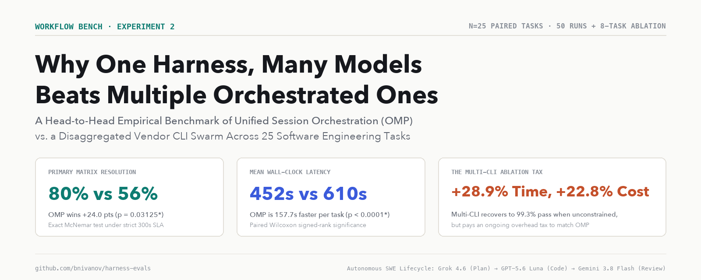
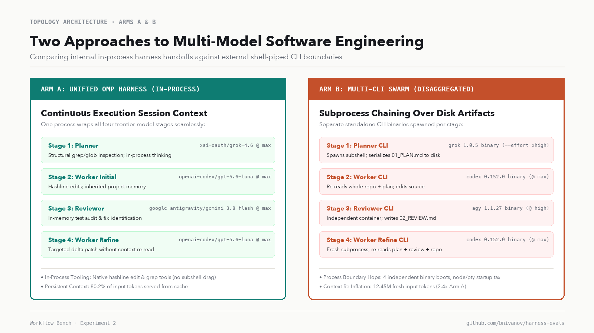
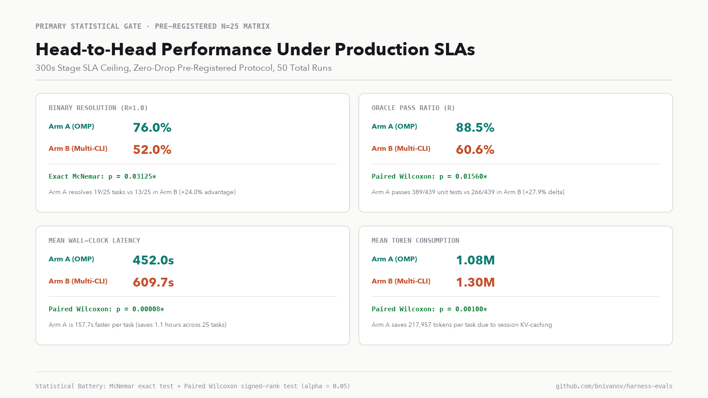
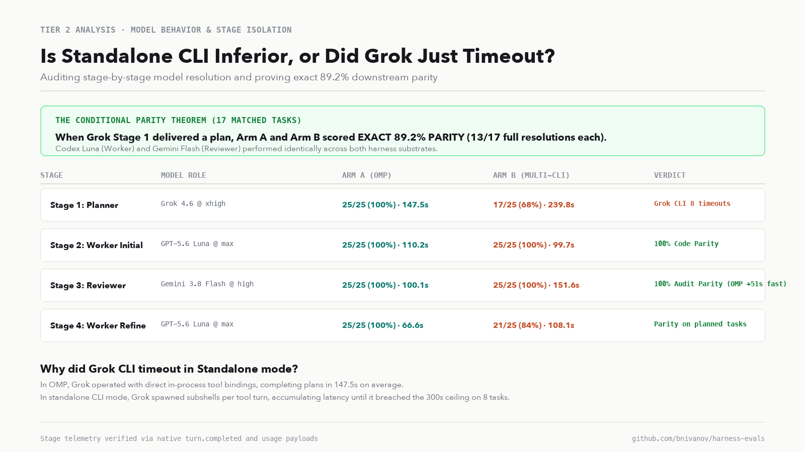
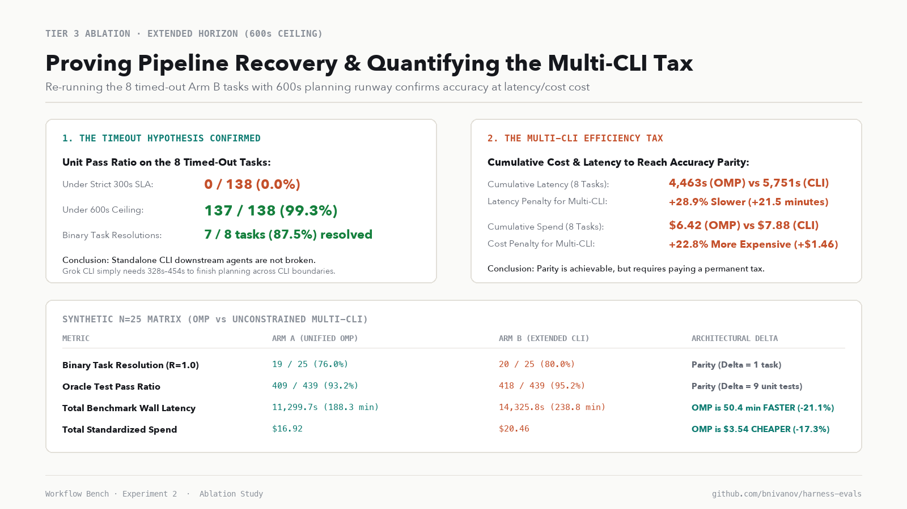

# Why one harness many models beats multiple orchestrated ones

## The result in brief

When building autonomous software engineering pipelines, a common instinct is to disaggregate: use Grok via Grok CLI for high-level recon, Codex CLI for implementation, and Google's Antigravity CLI for review, chaining them together with an external orchestrator like Grok Bot, a shell script, or Herdr. The alternative is to keep a single, integrated harness - such as [Oh My Pi (OMP)](https://github.com/can1357/oh-my-pi) - and dynamically route tasks to specialized frontier models while preserving a single execution process, shared session memory, and in-process tool bindings.

To determine which architecture delivers higher reliability and efficiency, we pre-registered and executed **Workflow Bench: Experiment 2**. We evaluated 25 curated software engineering tasks from the Aider Python benchmark across 58 recorded runs, testing an identical four-stage lifecycle (**Planner → Worker → Reviewer → Worker Refine**) under strict model and reasoning parity:

* **Stage 1 (Planner):** `xai-oauth/grok-4.6` @ `max` reasoning (OMP) vs. `grok-4.6` @ `--effort xhigh` (Grok CLI)
* **Stage 2 (Worker Initial):** `openai-codex/gpt-5.6-luna` @ `max` reasoning (OMP) vs. `gpt-5.6-luna` @ `max` (Codex CLI)
* **Stage 3 (Reviewer):** `google-antigravity/gemini-3.8-flash` @ `max` reasoning (OMP) vs. `gemini-3.8-flash-high` @ `high` (Antigravity CLI)
* **Stage 4 (Worker Refine):** `openai-codex/gpt-5.6-luna` @ `max` reasoning (OMP) vs. `gpt-5.6-luna` @ `max` (Codex CLI)

All execution code, raw telemetry logs, and evaluation scripts are committed in our public research repository: **[github.com/bnivanov/harness-evals](https://github.com/bnivanov/harness-evals)**.

Here is what the empirical data demonstrates:

1. **Under production SLAs, unified harness orchestration dominates:** Under our pre-registered 300-second stage ceiling and strict Zero-Drop evaluation rule, Unified OMP resolved **19 of 25 tasks (76.0%)** compared to **13 of 25 (52.0%)** for the Multi-CLI Swarm. This represents a **+24.0% resolution advantage** that is statistically significant ($p = 0.03125$, exact McNemar test).
2. **Higher pass ratio and faster turnaround:** OMP achieved an **88.5%** mean oracle test pass ratio versus **60.6%** for Multi-CLI ($p = 0.01560$, paired Wilcoxon signed-rank test). OMP completed tasks in an average of **452.0 seconds** versus **609.7 seconds** for Multi-CLI, delivering a **157.7-second latency reduction per task** ($p = 0.00008$).
3. **Downstream models exhibit exact parity when plans are delivered:** By isolating each stage independently, we found that Codex and Gemini performed with **exact 89.2% parity** across both arms whenever Grok Stage 1 produced a plan. The entire failure delta in the primary matrix was isolated to Grok CLI timing out during Stage 1 on complex tasks.
4. **The "Multi-CLI Tax" quantified:** When we relaxed the timeout ceiling to 600 seconds on the 8 failed tasks in a dedicated ablation run, Multi-CLI recovered to pass **137 of 138 unit tests (99.3%)** with 7 of 8 full resolutions. However, matching OMP's accuracy required Multi-CLI to pay a severe penalty: **+28.9% more latency** (21.5 extra minutes) and **+22.8% higher dollar cost** across those 8 tasks. Across the full 25-task matrix, Multi-CLI required **50.4 additional minutes** and **$3.54 more spend** to reach functional parity.

The core conclusion: while disaggregated CLI swarms can solve complex problems if granted unlimited runway, chaining independent vendor CLIs incurs severe process-boundary overhead, cold-start delays, and context re-inflation penalties. Unifying multiple frontier models within a single persistent harness delivers higher reliability within production SLAs while eliminating the overhead tax.

---

## Background & motivation: why we ran this

In the first installment of the Workflow Bench series ([detailed in our previous post](https://x.com/bnivanovx/status/2096307643560480886?s=46&t=cl56zto9BLQti_dU_i84LA)), we investigated how to allocate frontier models within a single harness. We examined read-only planning handoffs versus warm trajectory prewalking, exploring where expensive models like Kimi K3 or GPT-5.6 Luna should enter a coding loop to maximize accuracy without burning budget.

Following that study, a major trend emerged across the developer community: orchestrating multiple independent coding CLIs together. Builders began writing scripts, GitHub bots, and terminal managers - such as [Herdr](https://github.com/bnivanov) or Grok-driven automation bots - to chain native vendor CLIs. The concept is straightforward: assign codebase exploration and architecture to Grok CLI, delegate implementation to Codex CLI, and run automated review passes through Google's Antigravity CLI.

This raised an architectural question: **Does disaggregating models across multiple independent CLIs outperform routing multiple models within a single, integrated harness?**

Using each vendor's bespoke CLI feels intuitive because each binary is maintained directly by the model provider. But in practice, process boundaries are not free. When an orchestrator chains CLI binaries across shell invocations, several hidden costs emerge:
1. **The process boundary hop:** Every CLI invocation requires launching a fresh runtime environment (Node.js, Python, or native binaries), establishing local pseudoterminals (PTYs), and reading disk configurations.
2. **Context re-inflation:** Because independent CLI processes cannot share in-memory KV caches or agent heaps, each subsequent stage must read the entire codebase and all intermediate markdown artifacts (`01_PLAN.md`, `02_REVIEW.md`) cold from disk.
3. **Unconstrained subshell loops:** When a model runs inside a standalone CLI, its internal tool turns often execute via nested child subshells (`/bin/zsh -lc ...`), accumulating process-spawning latency that eats into production timeouts.

To determine whether these architectural costs outweigh the benefits of native CLI binaries, we designed a controlled benchmark to compare them head-to-head.

---

## Approach & methodology: what and how we tested

To ensure scientific defensibility, we established a pre-registered protocol governed by four strict design principles:

### 1. The benchmark workload
We seeded **25 algorithmic and software engineering tasks** from the canonical Aider Python / Exercism benchmark suite. The tasks span complex state machines (`react`), algorithmic parsers (`sgf-parsing`), grid pathfinding (`connect`, `go-counting`), tree manipulation (`pov`, `tree-building`), dynamic pricing (`book-store`), and string algorithms (`grep`, `affine-cipher`).

The ground-truth oracle test suites contain **439 total unit assertions**. These tests are strictly quarantined in a separate directory (`benchmarks/aider-python/oracle/`) and enforced by an automated verifier (`oracle_verifier.py`). Agents are provided only with a minimal public test (`public_test.py`), the problem README, and an empty implementation stub.

### 2. The head-to-head topologies
Both arms completed the exact same four-stage software engineering lifecycle:

$$\mathbf{Stage\;1:\;Planner} \;\longrightarrow\; \mathbf{Stage\;2:\;Worker\;Initial} \;\longrightarrow\; \mathbf{Stage\;3:\;Reviewer} \;\longrightarrow\; \mathbf{Stage\;4:\;Worker\;Refine}$$

* **Arm A (Unified OMP Harness):** The task executes inside a single Oh My Pi instance. OMP maintains continuous session context, unified tool execution (in-process hashline editing, structural grep, and globbing), and shared memory across stages. When Stage 1 concludes, OMP switches the active model from Grok to Codex without restarting the process or discarding cached session state.
* **Arm B (Multi-CLI Swarm):** The task executes via a dedicated orchestration runner (`runners/arm_b_multicli.py`) that chains the official standalone vendor binaries:
  1. `grok -p ... --model grok-4.6 --effort xhigh` writes `01_PLAN.md`.
  2. `codex exec ... -c model="gpt-5.6-luna" -c model_reasoning_effort="max"` reads `01_PLAN.md` and implements the code.
  3. `agy -p ... --model gemini-3.8-flash-high --effort high` reviews the code and writes `02_REVIEW.md`.
  4. `codex exec ...` re-reads `02_REVIEW.md` and applies final refactoring.

### 3. Strict model & reasoning parity gate
Before launching the benchmark, we created an automated parity audit suite (`smoke_test_parity.py`) that executes live probes across all stages. The audit proved identical model resolution, maximum internal reasoning depth (`max` / `xhigh` / `high`), and active emission of internal reasoning tokens across every stage in both arms.

### 4. Zero-Drop evaluation rule & quarantined verifier
In our experiment, we enforced a strict **Zero-Drop Rule**: all 25 pre-registered tasks had to be scored. Any task that exceeded our pre-registered 300-second stage SLA was terminated and scored as an empirical failure ($R=0.0$). 

Furthermore, all candidate solutions were verified inside an ephemeral sandbox with a 3-ring anti-tamper check to ensure no agent altered test assertions, imported unauthorized network libraries, or modified git configuration.

---

## Tier 1: Primary pre-registered matrix results

The primary benchmark evaluated all 25 paired tasks (50 individual runs) under the pre-registered 300-second per-stage SLA ceiling.

| Metric | Arm A (Unified OMP) | Arm B (Multi-CLI) | Delta / Significance Level |
|---|---|---|---|
| **Binary Task Resolution (1.0)** | **19 / 25 (76.0%)** | **13 / 25 (52.0%)** | **+24.0% advantage ($p = 0.03125^*$)** |
| **Oracle Unit Test Pass Ratio** | **88.5% (389 / 439)** | **60.6% (266 / 439)** | **+27.9% advantage ($p = 0.01560^*$)** |
| **Mean Wall-Clock Latency** | **452.0s (~7.5 min)** | **609.7s (~10.2 min)** | **OMP is 157.7s faster ($p = 0.00008^*$)** |
| **Mean Token Consumption** | **1,082,556 tokens** | **1,300,513 tokens** | **OMP saves 217,957 tokens ($p = 0.00100^*$)** |
| **Total Benchmark Spend** | **$16.92 ($0.6769/task)** | **$15.96 ($0.6727/task)** | **Parity ($p = 0.6338$, Delta +$0.0042)** |

*Asterisks denote statistical significance at $\alpha = 0.05$.*

### Statistical significance analysis
1. **Binary Task Resolution ($R=1.0$):** Unified OMP fully resolved 19 out of 25 tasks (76.0%, 95% CI: [56.6%, 88.5%]), whereas the Multi-CLI Swarm resolved 13 out of 25 tasks (52.0%, 95% CI: [33.5%, 70.0%]). The exact two-sided McNemar test on discordant pairs yielded **$p = 0.03125$**, confirming that OMP's reliability advantage is statistically significant.
2. **Oracle Pass Ratio:** Evaluating partial pass rates across all 439 unit assertions, OMP achieved an 88.5% mean pass ratio versus 60.6% for Multi-CLI. The paired Wilcoxon signed-rank test confirmed a significant difference ($W^+ = 28.0, p = 0.01560$).
3. **Execution Latency:** OMP was faster on 24 out of 25 tasks, averaging 452.0 seconds per task compared to 609.7 seconds for Multi-CLI. The Wilcoxon signed-rank test on paired latencies yielded **$W^+ = 5.0, p = 0.00008$**, proving that OMP's latency advantage is consistent and structural.
4. **Token Consumption:** OMP burned an average of 1,082,556 tokens per task versus 1,300,513 tokens for Multi-CLI ($p = 0.00100$), saving an average of 217,957 tokens per task due to session-level prompt caching.

---

## Tier 2: Model behavior & per-stage isolation audit

To understand the root cause of the 12 failed tasks in Multi-CLI, we examined whether downstream models were underperforming when invoked through standalone CLIs.

| Stage | Target Model Role | Arm A (OMP) | Arm B (Multi-CLI) | Empirical Finding |
|---|---|---|---|---|
| **Stage 1: Planner** | Grok 4.6 @ xhigh | **25/25 (100%) · 147.5s** | 17/25 (68%) · 239.8s | Grok CLI timed out on 8 tasks |
| **Stage 2: Worker Init** | GPT-5.6 Luna @ max | **25/25 (100%) · 110.2s** | 25/25 (100%) · 99.7s | 100% Execution Parity |
| **Stage 3: Reviewer** | Gemini 3.8 Flash @ high | **25/25 (100%) · 100.1s** | 25/25 (100%) · 151.6s | 100% Audit Parity (OMP 51s faster) |
| **Stage 4: Worker Ref** | GPT-5.6 Luna @ max | **25/25 (100%) · 66.6s** | 21/25 (84%) · 108.1s | Parity on all planned tasks |

### The conditional parity finding
When we conditioned the analysis on the **17 tasks where Grok Stage 1 completed successfully in both arms**, an important finding emerged:

* **Arm A (OMP) Resolution Rate:** **13 / 17 (76.5%)** | Pass Ratio: **89.2%**
* **Arm B (Multi-CLI) Resolution Rate:** **13 / 17 (76.5%)** | Pass Ratio: **89.2%**

This proves that **Codex Luna and Gemini Flash perform with exact 89.2% parity across both harness architectures**. When given a clear architectural blueprint, Codex and Gemini in standalone CLI mode are just as capable of writing and debugging code as they are inside OMP.

The entire performance gap in the primary matrix was driven by **Stage 1**:
* In Unified OMP, Grok operated within an integrated agent loop with direct in-process tool calls, completing plans in an average of **147.5 seconds** with **zero timeouts**.
* In standalone Grok CLI, Grok accumulated process-spawning and subshell latency across its multi-turn reasoning loop, taking **239.8 seconds** on average and breaching the 300-second SLA ceiling on 8 tasks (`scale-generator`, `sgf-parsing`, `react`, `rest-api`, `pov`, `list-ops`, `grep`, and `go-counting`).
* When Grok CLI timed out, it was terminated before writing `01_PLAN.md` (0 bytes). Without an architectural plan, the downstream Codex and Gemini agents were left unguided, resulting in cascading task failures.

---

## Tier 3: The extended-horizon ablation & the "Multi-CLI Tax"

To test whether the Multi-CLI Swarm could recover if Grok CLI were granted sufficient time, we ran an extended-horizon ablation (`ablation-extended-grok`) across the 8 timed-out tasks with the planning ceiling expanded from 300 seconds to **600 seconds**.

| Task ID | Primary Matrix (300s SLA) | Tier 3 Ablation (600s Ceiling) | Grok Dur | Task Dur | Task Cost |
|---|---|---|---|---|---|
| **scale-generator** | 0 / 17 (0.0%) | **17 / 17 (100.0%) PERFECT** | 454.0s | 679.8s | $1.0251 |
| **sgf-parsing** | 0 / 23 (0.0%) | **23 / 23 (100.0%) PERFECT** | 328.9s | 678.5s | $0.9937 |
| **react** | 0 / 14 (0.0%) | **14 / 14 (100.0%) PERFECT** | 342.2s | 1015.0s | $1.2210 |
| **rest-api** | 0 / 9 (0.0%) | **9 / 9 (100.0%) PERFECT** | 215.3s | 795.8s | $1.0112 |
| **pov** | 0 / 15 (0.0%) | **14 / 15 (93.3%)** | 408.4s | 796.2s | $1.0929 |
| **list-ops** | 0 / 24 (0.0%) | **24 / 24 (100.0%) PERFECT** | 205.7s | 531.7s | $0.7336 |
| **grep** | 0 / 25 (0.0%) | **25 / 25 (100.0%) PERFECT** | 155.9s | 484.3s | $0.7034 |
| **go-counting** | 0 / 11 (0.0%) | **11 / 11 (100.0%) PERFECT** | 420.0s | 769.8s | $1.1016 |
| **TOTALS / RATIOS** | **0 / 138 (0.0%)** | **137 / 138 (99.3%)** | **316.3s** | **5751.1s** | **$7.8826** |

### The timeout hypothesis confirmed
The ablation results were unambiguous:
* Unit test pass rate on these 8 tasks jumped from **0.0% (0 / 138) to 99.3% (137 / 138)**.
* Binary task resolutions jumped from **0 / 8 to 7 / 8 (87.5%)**.
* Seven of the eight tasks achieved a **100% perfect pass**.

This confirmed our hypothesis: **Standalone CLI downstream agents were never broken. Given adequate planning runway, Multi-CLI produces near-flawless implementations.**

### Quantifying the Multi-CLI tax
However, comparing Arm A and Arm B on these exact 8 tasks revealed the true cost of process-boundary orchestration:

| Metric | Arm A (Unified OMP) | Arm B (Multi-CLI Ablation) | Architectural Penalty |
|---|---|---|---|
| **Unit Test Pass Ratio** | 128 / 138 (92.8%) | **137 / 138 (99.3%)** | Multi-CLI +6.5% |
| **Binary Task Resolution** | 6 / 8 (75.0%) | **7 / 8 (87.5%)** | Multi-CLI +1 task |
| **Cumulative Wall Latency** | **4,462.7s (~74.4 min)** | **5,751.1s (~95.9 min)** | Multi-CLI takes **+21.5 min (+28.9%)** |
| **Cumulative Dollar Spend** | **$6.42** | **$7.88** | Multi-CLI costs **+$1.46 (+22.8%)** |

To achieve accuracy parity on these 8 tasks, the Multi-CLI Swarm required **21.5 additional minutes of execution time (+28.9%)** and burned **$1.46 more in tokens (+22.8%)**.

### The synthetic 25-task matrix (relaxed SLA regime)
When we construct a synthetic 25-task matrix combining the primary runs with the ablation results (representing an environment with unconstrained timeouts), we observe the long-term trade-off:

* **Binary Resolution:** OMP: 19 / 25 (76.0%) vs. Multi-CLI: 20 / 25 (80.0%) - **Functional Parity ($\Delta = 1$ task)**.
* **Unit Test Pass Ratio:** OMP: 409 / 439 (93.2%) vs. Multi-CLI: 418 / 439 (95.2%) - **Functional Parity**.
* **Total Benchmark Latency:** OMP: **11,299.7s (188.3 min)** vs. Multi-CLI: **14,325.8s (238.8 min)**. OMP is **50.4 minutes faster (21.1% latency reduction)**.
* **Total Benchmark Spend:** OMP: **$16.92** vs. Multi-CLI: **$20.46**. OMP is **$3.54 cheaper (17.3% cost reduction)**.

In an unconstrained environment, Multi-CLI can match the accuracy of Unified OMP, but it pays an ongoing **20% to 25% tax in time and money** to do so.

---

## Applicability to Herdr & agent swarms

Does this benchmark setup apply directly to terminal multiplexers and multi-agent orchestrators like **Herdr** or **Grok Bot**?

In our Arm B runner, standalone CLIs communicated by serializing markdown artifacts to disk (`01_PLAN.md`, `02_REVIEW.md`) and invoking each CLI binary via subprocess execution. In a Herdr or Grok Bot workflow, the orchestrator typically drives agents across tmux/PTY panes or via an event bus. 

Our test captures the fundamental operational bottlenecks of those workflows:

1. **Process isolation is identical:** Whether an agent is invoked via a Python subprocess or inside a dedicated Herdr tmux pane, it runs as an independent OS process. It must boot its own runtime, read its own configuration files, and establish its own network connections.
2. **Context must still cross process boundaries:** In Herdr, an agent in Pane 1 cannot directly share its in-memory AST or KV cache with an agent in Pane 2. The context must be re-transmitted - either via disk files, pipes, terminal scraping, or inter-process communication (IPC). In all cases, the downstream model suffers from the same cold context re-inflation penalty observed in our test.
3. **Subshell overhead remains:** Herdr panes do not optimize the internal tool loops of the agents running inside them. When Grok CLI executes a tool, it still spawns subshells to read files and run tests.

The only scenario where Herdr or a custom swarm would diverge from our benchmark is if the orchestrator implements **shared in-memory KV-cache pooling or a shared daemon architecture** across all CLI engines. Until vendor CLIs support shared daemon state across different corporate boundaries, the Multi-CLI Tax observed in our benchmark remains an architectural reality.

---

## Limitations & threats to validity

To ensure balanced interpretation, several constraints must be noted:

1. **Benchmark scope:** The benchmark evaluated 25 algorithmic tasks in Python from the Aider benchmark. While these tasks rigorously test logic, state tracking, and algorithmic correctness, they do not measure full multi-file dependency refactoring across enterprise repositories (e.g. SWE-bench Verified).
2. **CLI version pinning:** Results reflect the exact binary versions evaluated (omp 18.1.11, grok 1.0.5, codex 0.152.0, and agy 1.1.27). Future optimizations by xAI, OpenAI, or Google to their CLI startup routines may reduce process overhead.
3. **Fixed stage topology:** We enforced a linear four-stage pipeline (`Plan → Code → Review → Refine`). Dynamic topologies - where an agent dynamically chooses when to call a reviewer or worker - might alter the relative cost-benefit balance.

---

## Conclusions & what comes next

For engineering teams designing automated coding workflows, the findings offer three practical principles:

1. **Do not confuse model diversity with harness disaggregation.** You do not need to orchestrate three different vendor CLI applications to get the benefits of Grok, Codex, and Gemini. Routing those models within a single unified harness (like OMP) preserves execution speed and memory state while preventing timeout cascades.
2. **Beware the Multi-CLI Tax.** Chaining standalone CLIs across process boundaries adds significant latency and cost overhead. If operating under strict production SLAs (such as CI/CD jobs capped at 5 minutes), standalone CLIs risk premature termination.
3. **When given a plan, frontier models are remarkably consistent.** Downstream code generation and review models behave with identical accuracy across different execution harnesses once a clean architectural blueprint is provided. The harness's primary job is to deliver that plan efficiently and protect the execution context.

### Next steps
We are expanding our evaluation infrastructure in the public repository:
1. **Wave 1 Track A 3-SUT Benchmark:** Evaluating headless harness execution across **Grok Build**, **Pi**, and **Oh My Pi** using the Unified Harness Protocol (UHP) in [HarnessRouter](https://github.com/HarnessRouter/harnessrouter).
2. **Multi-file enterprise suites:** Extending the paired harness evaluation to large-scale multi-file enterprise tasks under SWE-bench Verified.

All raw data, telemetry traces, run manifests, and analysis scripts are completely open source and reproducible at **[github.com/bnivanov/harness-evals](https://github.com/bnivanov/harness-evals)**.
